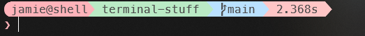

# terminal-stuff

personal windows terminal customisation

## what's inside

- custom powershell profile
- oh my posh theme (pastel colours)
- scripts for easy setup

## prerequisites

- [oh my posh](https://ohmyposh.dev/docs/installation/windows) installed
- windows terminal (optional but recommended)

## how to use

1. clone this repo
2. run setup script
3. customise username and hostname (see below)
4. add oh my posh init to your powershell profile:

```powershell
oh-my-posh init pwsh --config "C:\path\to\jamiedev.omp.json" | Invoke-Expression
```

adjust the path to where you've saved the `jamiedev.omp.json` file

5. enjoy your new terminal look

for more detailed setup instructions, check the [oh my posh docs](https://ohmyposh.dev/docs/installation/prompt)

## customisation

### username and hostname

edit your powershell profile:

```powershell
$env:CUSTOM_USERNAME = "your_username"
$env:CUSTOM_HOSTNAME = "your_hostname"
```

### colours and settings

feel free to tweak the oh my posh theme to your needs!

## preview

